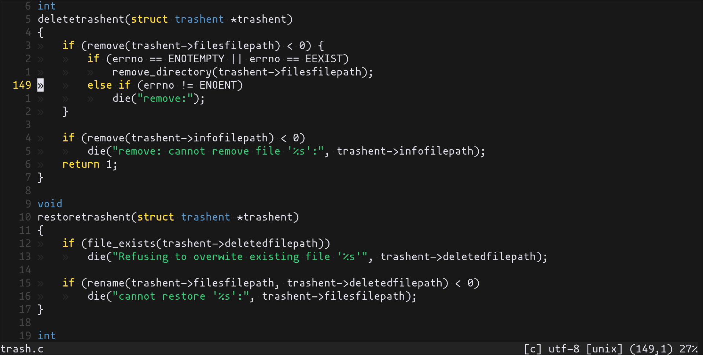
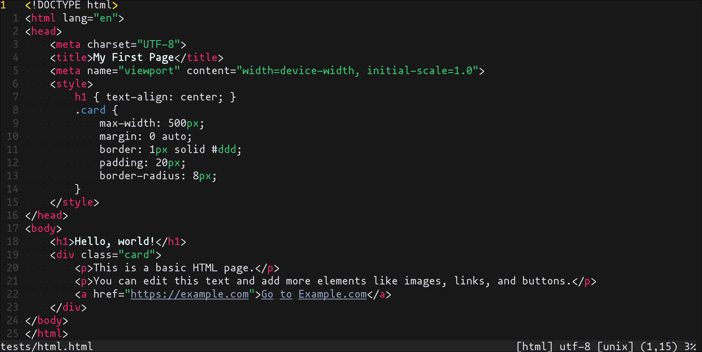
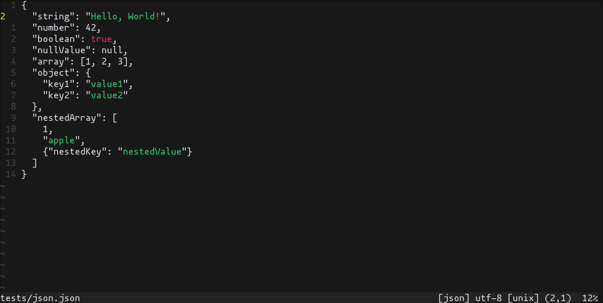

# Darkside

A dark [Neovim](https://github.com/neovim/neovim) theme written in
[Lua](https://www.lua.org), designed to be minimalistic, following a strict
philosophy where nearly everything remains white except a small set of
intentionally highlighted elements.

## Previews

Below are example renderings of different languages:





## Installation

Download with your favorite package manager.

[lazy.nvim](https://github.com/folke/lazy.nvim)
```lua
{ "darkside/nvim" }
```

[mini.deps](https://github.com/echasnovski/mini.nvim/blob/main/readmes/mini-deps.md)
```lua
add({ source = "darkside/nvim" })
```

[packer.nvim](https://github.com/wbthomason/packer.nvim)
```lua
use { "darkside/nvim" }
```

[vim-plug](https://github.com/junegunn/vim-plug)
```vim
Plug 'darkside/nvim'
```

## Usage

Simply set the colorscheme with the builtin command `:colorscheme`

```lua
vim.cmd.colorscheme "darkside"
```

## Configuration

> [!IMPORTANT]
> Set the configuration **BEFORE** loading the color scheme with `colorscheme darkside`.

There is no need to call `setup` if you don't want to change the default options and settings.

```lua
require("darkside").setup({
    compile_path = vim.fn.stdpath "cache" .. "/darkside",
    transparent_background = false,
    float = {
        transparent = true,
    },
    default_modules = true,
    modules = {
        -- [nvim-cmp](https://github.com/hrsh7th/nvim-cmp)
        cmp = true,
        -- [neogit](https://github.com/NeogitOrg/neogit)
        neogit = true,
        -- [gitsigns](https://github.com/lewis6991/gitsigns.nvim)
        gitsigns = true,
    },

})
```
### Modules

Darkside modules define theme integrations for various plugins and Neovim
features. A module is enabled by setting it to `true`.

Modules are enabled by default. To disable default enabling, set
`default_modules = false`.

Example overriding a specific module:

```lua
modules = {
    cmp = false,
}
```

## Acknowledgements

* [Gruber Darker](https://github.com/rexim/gruber-darker-theme)
* [Catppuccin](https://github.com/catppuccin/nvim)
* [Nightfox](https://github.com/EdenEast/nightfox.nvim)

## Contributing

Pull requests are welcome!
